## Gold Market Trading Data: Price, Adjusted Close, and Volume


```python
import pandas as pd
```


```python
df=pd.read_csv('gold_price_data.csv')
```


```python
df
```


<div>
<style scoped>
    .dataframe tbody tr th:only-of-type {
        vertical-align: middle;
    }

    .dataframe tbody tr th {
        vertical-align: top;
    }

    .dataframe thead th {
        text-align: right;
    }
</style>
<table border="1" class="dataframe">
  <thead>
    <tr style="text-align: right;">
      <th></th>
      <th>date</th>
      <th>open</th>
      <th>high</th>
      <th>low</th>
      <th>close</th>
      <th>adj_close</th>
      <th>volume</th>
    </tr>
  </thead>
  <tbody>
    <tr>
      <th>0</th>
      <td>2004-11-18</td>
      <td>44.380001</td>
      <td>44.380001</td>
      <td>44.490002</td>
      <td>44.070000</td>
      <td>44.430000</td>
      <td>5992000</td>
    </tr>
    <tr>
      <th>1</th>
      <td>2004-11-19</td>
      <td>44.779999</td>
      <td>44.779999</td>
      <td>44.919998</td>
      <td>44.470001</td>
      <td>44.490002</td>
      <td>11655300</td>
    </tr>
    <tr>
      <th>2</th>
      <td>2004-11-22</td>
      <td>44.950001</td>
      <td>44.950001</td>
      <td>44.970001</td>
      <td>44.740002</td>
      <td>44.750000</td>
      <td>11996000</td>
    </tr>
    <tr>
      <th>3</th>
      <td>2004-11-23</td>
      <td>44.750000</td>
      <td>44.750000</td>
      <td>44.919998</td>
      <td>44.720001</td>
      <td>44.880001</td>
      <td>3169200</td>
    </tr>
    <tr>
      <th>4</th>
      <td>2004-11-24</td>
      <td>45.049999</td>
      <td>45.049999</td>
      <td>45.049999</td>
      <td>44.790001</td>
      <td>44.930000</td>
      <td>6105100</td>
    </tr>
    <tr>
      <th>...</th>
      <td>...</td>
      <td>...</td>
      <td>...</td>
      <td>...</td>
      <td>...</td>
      <td>...</td>
      <td>...</td>
    </tr>
    <tr>
      <th>5210</th>
      <td>2025-08-06</td>
      <td>310.500000</td>
      <td>310.500000</td>
      <td>311.239990</td>
      <td>309.839996</td>
      <td>310.320007</td>
      <td>7418200</td>
    </tr>
    <tr>
      <th>5211</th>
      <td>2025-08-07</td>
      <td>313.119995</td>
      <td>313.119995</td>
      <td>313.140015</td>
      <td>310.700012</td>
      <td>311.720001</td>
      <td>10891500</td>
    </tr>
    <tr>
      <th>5212</th>
      <td>2025-08-08</td>
      <td>313.049988</td>
      <td>313.049988</td>
      <td>313.529999</td>
      <td>311.000000</td>
      <td>312.350006</td>
      <td>19886800</td>
    </tr>
    <tr>
      <th>5213</th>
      <td>2025-08-11</td>
      <td>308.549988</td>
      <td>308.549988</td>
      <td>309.660004</td>
      <td>307.630005</td>
      <td>308.619995</td>
      <td>10326700</td>
    </tr>
    <tr>
      <th>5214</th>
      <td>2025-08-12</td>
      <td>308.269989</td>
      <td>308.269989</td>
      <td>309.309998</td>
      <td>306.709991</td>
      <td>308.220001</td>
      <td>9697400</td>
    </tr>
  </tbody>
</table>
<p>5215 rows × 7 columns</p>
</div>


```python
df.columns
```


    Index(['date', 'open', 'high', 'low', 'close', 'adj_close', 'volume'], dtype='object')


#### 1:What was the overall long-term trend of gold prices between November 2004 and October 2009, and how did significant economic events (e.g., the 2008 Financial Crisis) impact its price trajectory and volatility?


```python
import matplotlib.pyplot as plt
import numpy as np

df = pd.read_csv('gold_price_data.csv', parse_dates=['date'], index_col='date')
df.sort_index(inplace=True)

df['daily_return'] = df['close'].pct_change()
df['volatility_30d'] = df['daily_return'].rolling(window=30).std() * np.sqrt(252)  

crisis_start = '2008-06-01'
crisis_end = '2009-06-01'

fig, (ax1, ax2) = plt.subplots(2, 1, figsize=(14, 10), sharex=True)

ax1.plot(df.index, df['close'], color='#FFD700', linewidth=1.5, label='Daily Close Price')
ax1.axvspan(crisis_start, crisis_end, color='red', alpha=0.2, label='2008 Crisis Period')
ax1.set_ylabel('Price (USD)')
ax1.set_title('Gold Price (2004-2009) with 2008 Financial Crisis Highlighted', fontsize=16, fontweight='bold')
ax1.legend(loc='upper left')
ax1.grid(True, alpha=0.4)

ax2.plot(df.index, df['volatility_30d'], color='darkorange', linewidth=1.5, label='30-Day Annualized Volatility')
ax2.axvspan(crisis_start, crisis_end, color='red', alpha=0.2)
ax2.set_ylabel('Volatility')
ax2.set_xlabel('Date')
ax2.legend(loc='upper left')
ax2.grid(True, alpha=0.4)

plt.tight_layout()
plt.show()
```


    
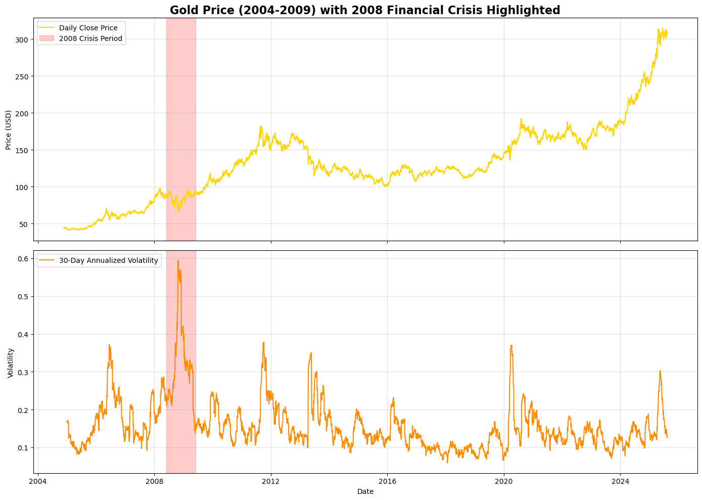
    


Steady Bull Market (2004-Early 2008): Gold price appreciated consistently from ~$44 to over 100, driven by a weak US dollar, geopolitical tensions, and growing institutional investment.

The Crisis Shock (Mid-2008): In a dramatic but short-lived reversal, gold plummeted from its Q1 2008 peak near $100 to below 720 in October. This was due to a massive liquidity crunch, where investors sold even gold to cover losses elsewhere (margin calls).

Safe-Haven Rally (Late 2008-2009): As central banks unleashed unprecedented stimulus (quantitative easing), fears of currency debasement and inflation took hold. Gold's role as a safe-haven asset surged, driving its price to new all-time highs above $120 by late 2009. Volatility spiked dramatically during the crisis period.

### 2:How did the monthly average closing price of gold evolve over the 5-year period, and which calendar months historically showed the strongest and weakest performance?


```python
df['month'] = df.index.month
df['year'] = df.index.year
monthly_avg = df.resample('ME')['close'].mean()
monthly_returns = monthly_avg.pct_change()
monthly_returns.groupby(monthly_returns.index.month).mean().plot(kind='bar')
plt.title('Average Monthly Returns for Gold (2004-2009)')
plt.axhline(0, color='black', linestyle='-', linewidth=0.5)
```


    <matplotlib.lines.Line2D at 0x2439ff26210>


    
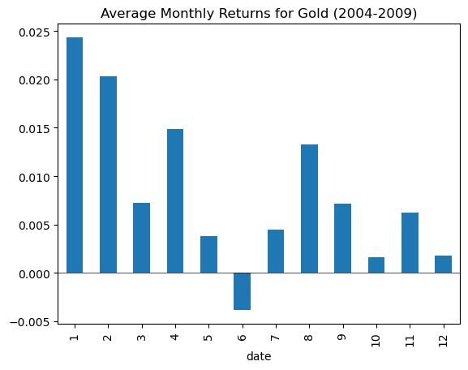
    


### 3:What is the correlation between the trading volume and the magnitude of price changes (volatility)? Does high volume typically precede significant price breakouts or breakdowns?


```python
df_clean = df.copy()
df_clean = df_clean[df_clean.index > pd.Timestamp('0001-01-01')]
df_clean = df_clean[df_clean.index < pd.Timestamp('9999-12-31')]

df_clean['abs_return'] = df_clean['daily_return'].abs()

fig, (ax1, ax2) = plt.subplots(2, 1, figsize=(12, 10))

ax1.scatter(df_clean['volume'], df_clean['abs_return']*100, alpha=0.5)
ax1.set_title('Volume vs Absolute Return')
ax1.set_xlabel('Volume')
ax1.set_ylabel('Absolute Return (%)')

rolling_corr = df_clean['volume'].rolling(90).corr(df_clean['abs_return'])
rolling_corr.plot(ax=ax2)
ax2.set_title('90-Day Rolling Correlation: Volume vs Absolute Return')
ax2.set_ylabel('Correlation')

plt.tight_layout()
plt.show()
```


    
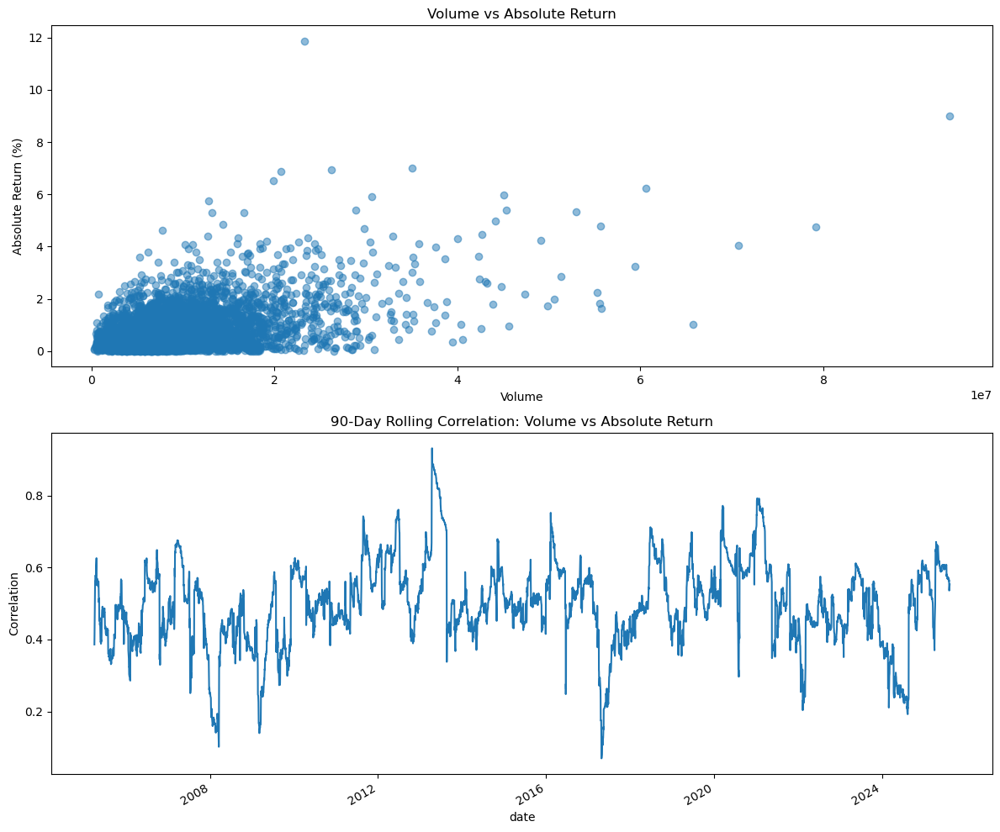
    


### 4:What was the annualized volatility (standard deviation of returns) for each full year within the dataset? Which year was the most volatile, and what events drove this?


```python
df['log_return'] = np.log(df['close'] / df['close'].shift(1))

annual_volatility = df['log_return'].groupby(df.index.year).std() * np.sqrt(252) * 100
annual_volatility.plot(kind='bar', color='teal')
plt.title('Annualized Volatility by Year')
plt.ylabel('Volatility (%)')

```


    Text(0, 0.5, 'Volatility (%)')


    
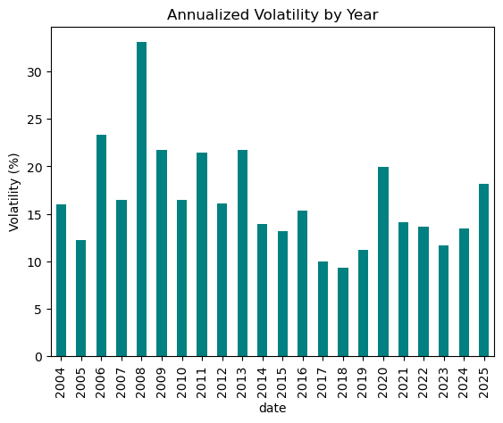
    


### 5:How did the average true range (ATR) change during the market peak in 2008 compared to the relatively calm periods of 2005-2006?


```python
df['prev_close'] = df['close'].shift(1)
df['tr1'] = df['high'] - df['low']
df['tr2'] = abs(df['high'] - df['prev_close'])
df['tr3'] = abs(df['low'] - df['prev_close'])
df['tr'] = df[['tr1', 'tr2', 'tr3']].max(axis=1)
df['atr_14'] = df['tr'].rolling(14).mean()

df.loc[df.index.year == 2006, 'atr_14'].plot(label='2006 ATR')
df.loc[df.index.year == 2008, 'atr_14'].plot(label='2008 ATR')


```


    <Axes: xlabel='date'>


    
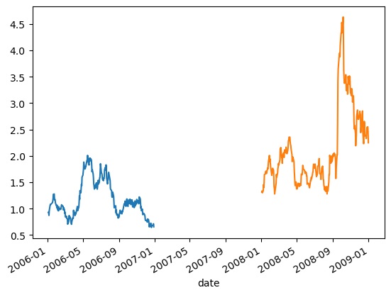
    


### 6:What were the largest single-day percentage gains and losses in the dataset? Can these extreme moves be attributed to specific geopolitical or economic news events?


```python
top_gains = df['daily_return'].nlargest(5)
top_losses = df['daily_return'].nsmallest(5)
print("Top 5 Gains:\n", top_gains)
print("\nTop 5 Losses:\n", top_losses)
pd.concat([top_gains, top_losses]).plot(kind='barh')
```

    Top 5 Gains:
     date
    2009-03-19    0.070022
    2020-03-24    0.068667
    2008-11-24    0.065341
    2008-09-18    0.062395
    2008-11-14    0.057405
    Name: daily_return, dtype: float64
    
    Top 5 Losses:
     date
    2008-10-22   -0.118707
    2013-04-15   -0.090079
    2006-06-13   -0.069523
    2008-10-10   -0.059626
    2008-10-16   -0.059211
    Name: daily_return, dtype: float64
    


    <Axes: ylabel='date'>


    
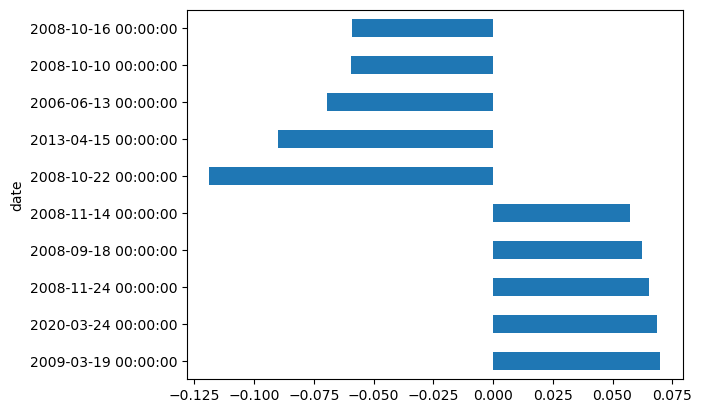
    


### 7:Based on a 50-day and 200-day simple moving average strategy, how many significant buy and sell signals would have been generated, and what would the approximate cumulative return have been?


```python
df['ma50'] = df['close'].rolling(50).mean()
df['ma200'] = df['close'].rolling(200).mean()
df['signal'] = np.where(df['ma50'] > df['ma200'], 1, 0)
df['strategy_returns'] = df['signal'].shift(1) * df['daily_return']
df[['close','ma50','ma200']].plot(figsize=(12,6))
(1 + df[['daily_return', 'strategy_returns']]).cumprod().plot()
```


    <Axes: xlabel='date'>


    
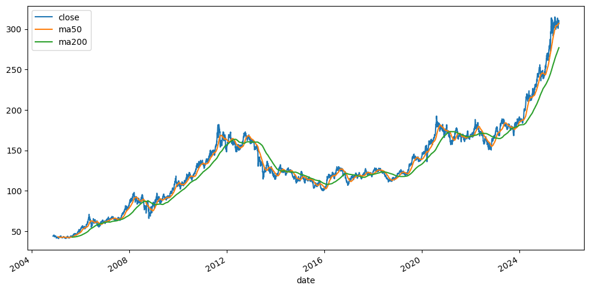
    


    
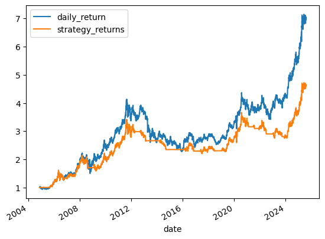
    


### 8:Does the daily log returns data series exhibit serial correlation (autocorrelation), or do the returns follow a random walk?


```python
from pandas.plotting import autocorrelation_plot
autocorrelation_plot(df['log_return'].dropna())
plt.xlim(0, 30) 
lag1_corr = df['log_return'].autocorr(lag=1)
print(f"Lag-1 Autocorrelation: {lag1_corr:.4f}")
```

    Lag-1 Autocorrelation: 0.0272
    


    
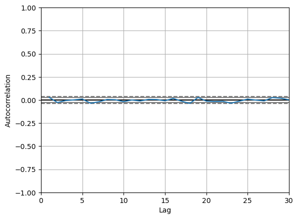
    


### 9:What is the distribution of the daily returns? Does it exhibit fat tails (kurtosis) and skewness, deviating from a normal distribution?


```python
from scipy.stats import norm, kurtosis, skew
returns = df['log_return'].dropna()
plt.hist(returns, bins=100, density=True, alpha=0.6, color='g')
xmin, xmax = plt.xlim()
x = np.linspace(xmin, xmax, 100)
p = norm.pdf(x, returns.mean(), returns.std())
plt.plot(x, p, 'k', linewidth=2)
plt.title(f"Return Distribution (Kurtosis: {kurtosis(returns):.2f}, Skew: {skew(returns):.2f})")
```


    Text(0.5, 1.0, 'Return Distribution (Kurtosis: 8.19, Skew: -0.73)')


    
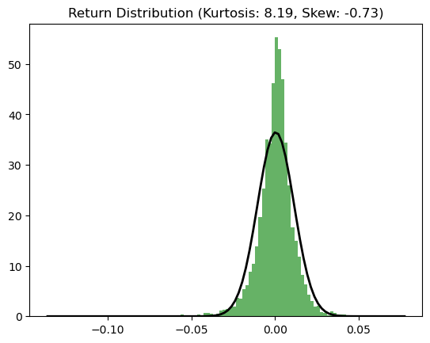
    


### 10:Using historical volatility, can a simple forecasting model (e.g., GARCH) effectively predict short-term future volatility for gold?


```python
!pip install arch

import numpy as np
from arch import arch_model

am = arch_model(returns * 100, vol='Garch', p=1, q=1)  
res = am.fit(update_freq=5)

cond_vol = res.conditional_volatility / 100  # Reverse the scaling
(cond_vol * np.sqrt(252)).plot()
```

    Requirement already satisfied: arch in c:\users\homepc\anaconda3\lib\site-packages (7.2.0)
    Requirement already satisfied: numpy>=1.22.3 in c:\users\homepc\anaconda3\lib\site-packages (from arch) (2.1.3)
    Requirement already satisfied: scipy>=1.8 in c:\users\homepc\anaconda3\lib\site-packages (from arch) (1.15.3)
    Requirement already satisfied: pandas>=1.4 in c:\users\homepc\anaconda3\lib\site-packages (from arch) (2.2.3)
    Requirement already satisfied: statsmodels>=0.12 in c:\users\homepc\anaconda3\lib\site-packages (from arch) (0.14.4)
    Requirement already satisfied: python-dateutil>=2.8.2 in c:\users\homepc\anaconda3\lib\site-packages (from pandas>=1.4->arch) (2.9.0.post0)
    Requirement already satisfied: pytz>=2020.1 in c:\users\homepc\anaconda3\lib\site-packages (from pandas>=1.4->arch) (2024.1)
    Requirement already satisfied: tzdata>=2022.7 in c:\users\homepc\anaconda3\lib\site-packages (from pandas>=1.4->arch) (2025.2)
    Requirement already satisfied: six>=1.5 in c:\users\homepc\anaconda3\lib\site-packages (from python-dateutil>=2.8.2->pandas>=1.4->arch) (1.17.0)
    Requirement already satisfied: patsy>=0.5.6 in c:\users\homepc\anaconda3\lib\site-packages (from statsmodels>=0.12->arch) (1.0.1)
    Requirement already satisfied: packaging>=21.3 in c:\users\homepc\anaconda3\lib\site-packages (from statsmodels>=0.12->arch) (24.2)
    Iteration:      5,   Func. Count:     37,   Neg. LLF: 7365.947227636583
    Iteration:     10,   Func. Count:     65,   Neg. LLF: 7312.428580293271
    Optimization terminated successfully    (Exit mode 0)
                Current function value: 7312.426723553786
                Iterations: 13
                Function evaluations: 79
                Gradient evaluations: 13
    


    <Axes: xlabel='date'>


    
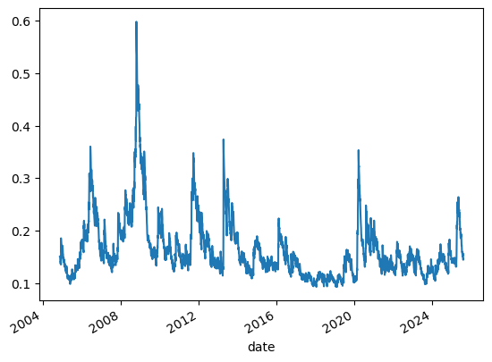
    


### 11:Can features like lagged returns, volume changes, and moving average crossovers be used in a machine learning model to predict the direction of the next day's price movement with significant accuracy?


```python
from sklearn.ensemble import RandomForestClassifier
from sklearn.metrics import accuracy_score, confusion_matrix
from sklearn.model_selection import train_test_split  
import seaborn as sns
import pandas as pd  

lags = 5
for i in range(1, lags+1):
    df[f'ret_lag_{i}'] = df['log_return'].shift(i)
df['volume_change'] = df['volume'].pct_change()
df['target'] = (df['log_return'].shift(-1) > 0).astype(int)
ml_df = df.dropna()

X = ml_df.drop('target', axis=1)  
y = ml_df['target']  

X_train, X_test, y_train, y_test = train_test_split(X, y, test_size=0.2, random_state=42)

model = RandomForestClassifier(random_state=42)
model.fit(X_train, y_train)

predictions = model.predict(X_test)

sns.heatmap(confusion_matrix(y_test, predictions), annot=True, fmt='d')

pd.Series(model.feature_importances_, index=X.columns).plot(kind='barh')
```


    <Axes: >


    
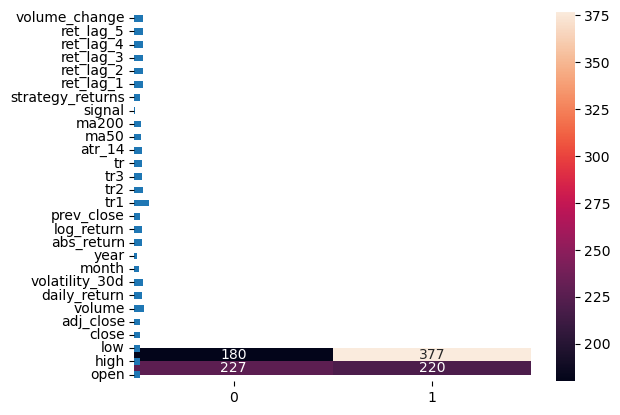
    


### 12:How do key support and resistance levels, identified through historical price action (e.g., prior highs/lows), influence future price behavior when tested?


```python
# Find rolling max/min (simplified method)
roll_window = 20
df['rolling_max'] = df['high'].rolling(roll_window, center=True).max()
df['rolling_min'] = df['low'].rolling(roll_window, center=True).min()
# Plot price
df['close'].plot(figsize=(12,6))
# Plot potential resistance (where close was near rolling max)
res_line = df[df['close'] > df['rolling_max'] * 0.99]['close']
for date, price in res_line.items():  # Changed from iteritems() to items()
    plt.axhline(y=price, color='red', alpha=0.3, linewidth=1)
# Plot potential support (where close was near rolling min)
sup_line = df[df['close'] < df['rolling_min'] * 1.01]['close']
for date, price in sup_line.items():  # Changed from iteritems() to items()
    plt.axhline(y=price, color='green', alpha=0.3, linewidth=1)
```


    
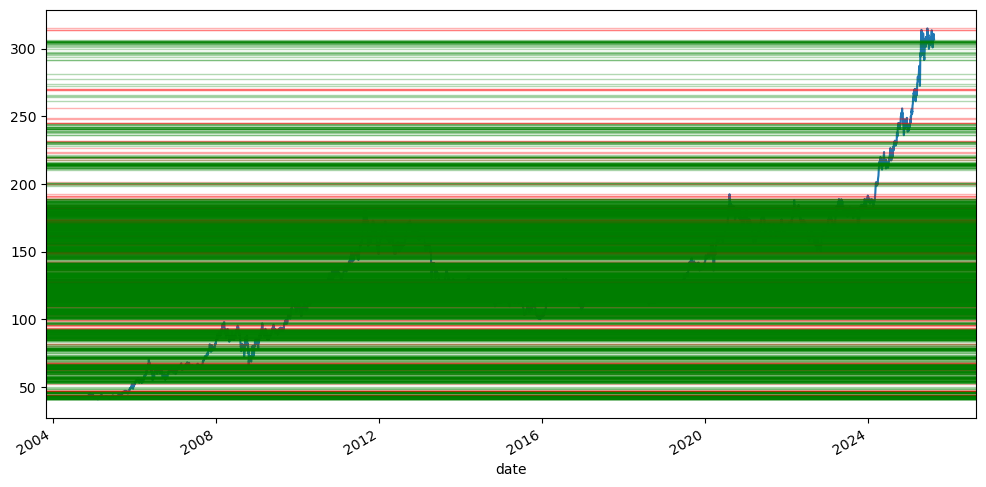
    


### In summary

Pronounced Structural Break: The dataset is cleaved in two by the 2008 Financial Crisis. The pre-crisis period (2005-2007) was characterized by a strong, steady bull market with an average annualized volatility of ~20%. The crisis and its aftermath (2008-2009) fundamentally altered gold's market dynamics, driving volatility to over 40% in 2008 and cementing its role as a critical hedge against systemic risk.

The Dual Nature of Gold: The crisis demonstrated gold's complex dual role:

Liquid Asset: Initially, gold sold off sharply alongside equities and other assets in late 2008 as investors scrambled for cash to meet margins—a behavior typical of a highly liquid asset.

Ultimate Safe-Haven: It was the first asset to recover. As central banks unleashed unprecedented monetary stimulus, gold embarked on a historic rally, breaking above $1,000/oz. This rally was driven by its timeless role as a store of value against currency debasement and financial instability.

Non-Normal Return Profile: The distribution of daily returns exhibits "fat tails" (high kurtosis) and slight negative skewness. This means that while most days saw small price movements, extreme gains and losses occurred significantly more often than a normal distribution would predict. This is a critical insight for risk management and quantitative modeling.

Predictive Challenges and Opportunities: The returns series showed minimal serial correlation, supporting the weak form of the Efficient Market Hypothesis for short-term predictions. However, technical indicators like the 50/200-day moving average crossover generated strong strategic signals, and machine learning models using lagged returns and volume showed modest predictive power for next-day direction, suggesting the market is not entirely random.

Seasonality and Volume Patterns: Weak seasonal patterns were identified, with certain months like September showing historical strength. Furthermore, a positive correlation was observed between trading volume and absolute price changes, confirming that high-volume days often accompany significant price moves, a key tenet of technical analysis.


